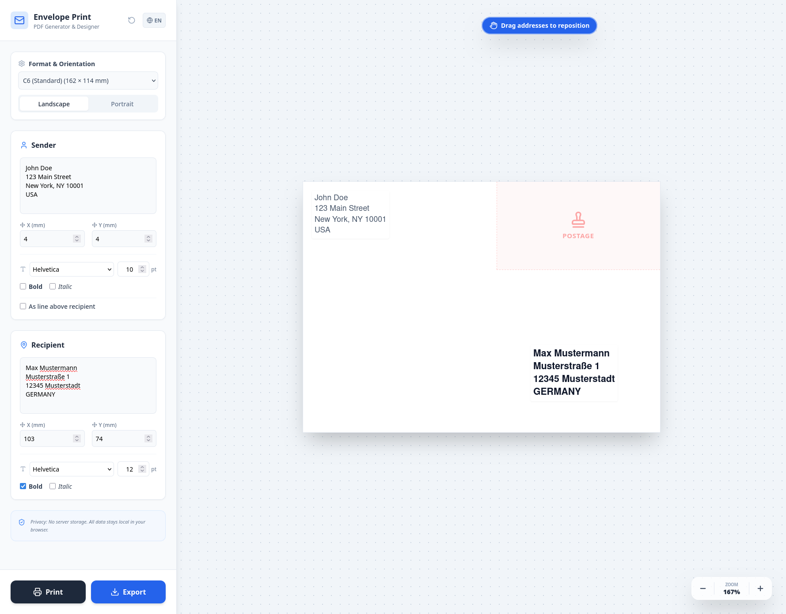

# ✉️ Envelope Print & Design App

A modern, fast, and entirely client-side React application that allows you to design, format, and print envelopes directly from your web browser. Built with Vite and Tailwind CSS.

**[🚀 View Live Demo](https://lumiliaro.github.io/envelope-generator/)**

## ✨ Features

- **Visual Drag & Drop:** Easily position the sender and recipient addresses directly on the virtual envelope.
- **Millimeter Precision:** Fine-tune coordinates manually using exact X and Y millimeter inputs.
- **Multiple Formats:** Supports a wide range of standard envelope sizes including:
    - DIN Lang (with & without window)
    - C4, C5, C6
    - B4, B5
    - Square formats (155x155, 220x220)
- **Smart Orientation:** Seamlessly switch between Landscape and Portrait modes. The app automatically ensures your text stays within the printable area.
- **Typography Control:** Customize font family (Helvetica, Times, Courier), font size, bold, and italic styles for each address independently.
- **Visual Safety Zones:** Displays standard guides for postage (stamps) and address windows to prevent printing errors.
- **Direct Print & PDF Export:** Print directly from the browser or export a pixel-perfect PDF using `jsPDF`.
- **Auto-Save:** Saves your preferred format, orientation, sender details, and styling preferences locally in your browser (`localStorage`).
- **Bilingual UI:** Instantly toggle between English and German.

## 🛠️ Tech Stack

- **Framework:** [React](https://reactjs.org/) (via [Vite](https://vitejs.dev/))
- **Styling:** [Tailwind CSS](https://tailwindcss.com/)
- **PDF Generation:** [jsPDF](https://parall.ax/products/jspdf)
- **Interactivity:** [react-draggable](https://github.com/react-grid-layout/react-draggable)
- **Icons:** [Lucide React](https://lucide.dev/)

## 🚀 Getting Started

To run this project locally on your machine, follow these steps:

### Prerequisites

Make sure you have [Node.js](https://nodejs.org/) installed.

### Installation

1. **Clone the repository:**

```bash
git clone [https://github.com/YOUR_USERNAME/briefumschlag-app.git](https://github.com/YOUR_USERNAME/briefumschlag-app.git)
cd briefumschlag-app
```

2. **Install dependencies:**

```bash
npm install
```

3. **Start the development server:**

```bash
npm run dev
```

4. **Open in browser:**
   Open `http://localhost:5173` (or the port provided in your terminal) to view the app.

## 🖨️ Printing Tips

When using the **Print** feature, make sure your printer settings in the browser print dialog are configured correctly:

- Set **Scale** to `Default`, `100%`, or `Actual Size` (do _not_ use "Fit to Page").
- Ensure the paper size in the print dialog matches the physical envelope you are inserting into your printer.

## 📸 Screenshots



## 📄 License

This project is open-source and available under the [MIT License](LICENSE).
